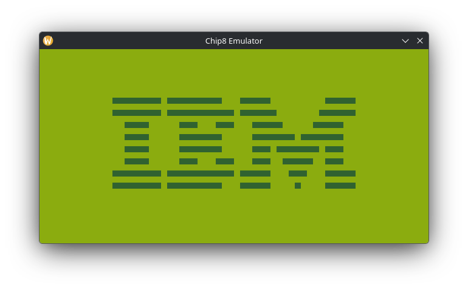
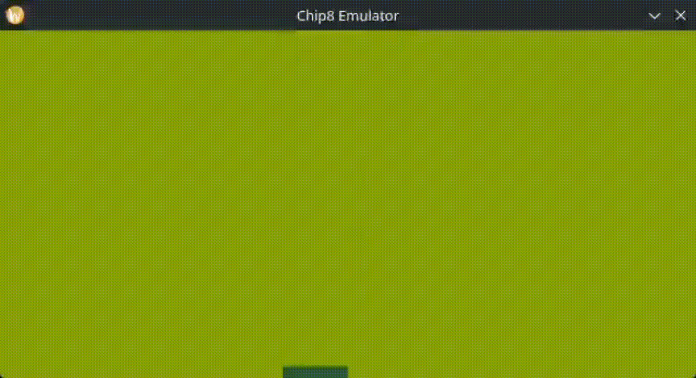
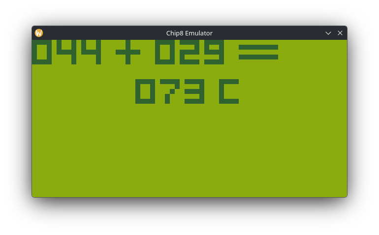
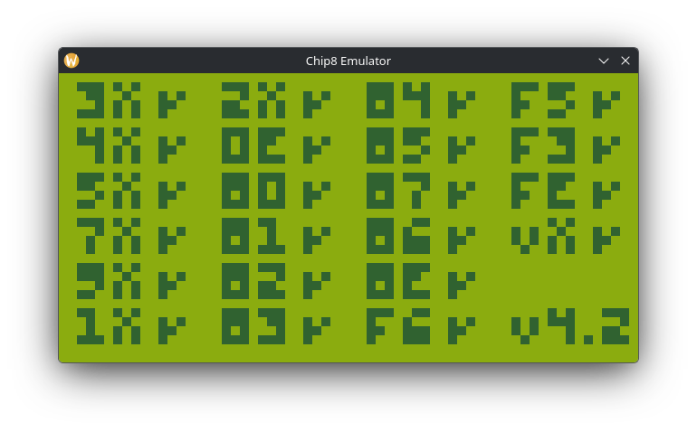
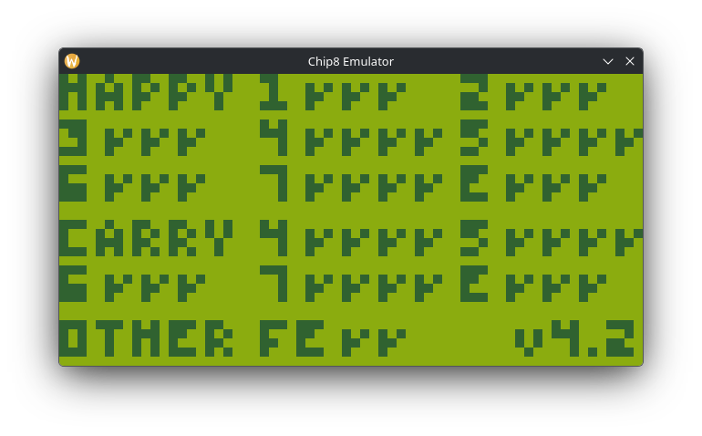
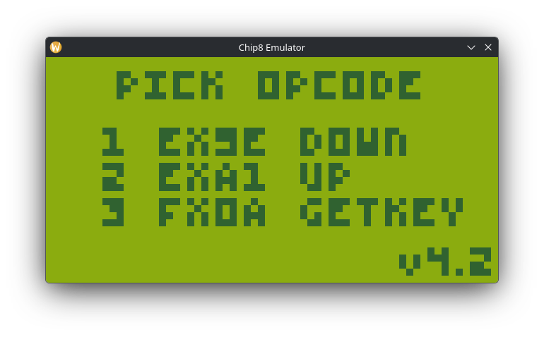
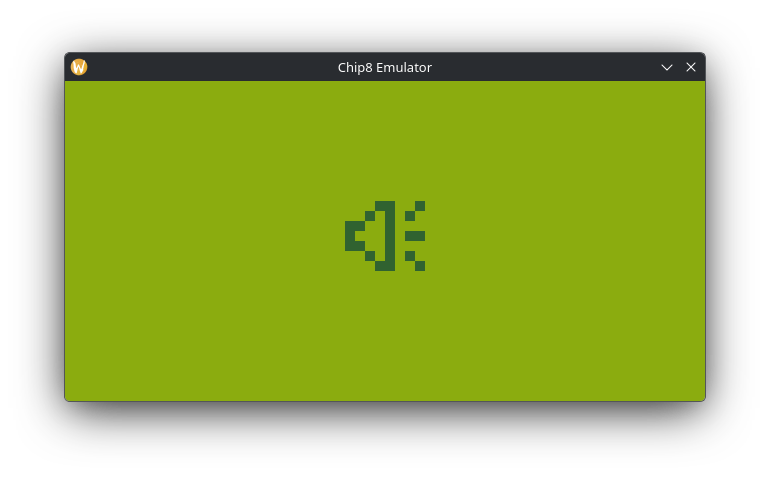

# CHIP8 - Emulator & Assembler

In this repository is my implementation of an emulator along with an assembler created for CHIP-8. The emulator is responsible for simulating the hardware on which this interpreted language originally ran, while the assembler can be used to translate code written in a specific Assembly syntax into executables compatible with the CHIP-8 VM.

# Table of contents

- [What is CHIP-8?](#what-is-chip-8)
  - [VM Description](#vm-description)
- [Emulator (CEMU)](#emulator-cemu)
    - [Features](#features)
    - [Preview](#preview)
    - [Tests](#tests)
- [Assembler (CASM)](#assembler-casm)
    - [Example ROMs](#example-roms)
- [Usage](#usage)
    - [Requirements](#requirements)
    - [Dependency instalation](#dependency-instalation)
    - [Cloning the repository](#cloning-the-repository)
    - [Building](#building)
    - [CEMU](#cemu)
        - [Options](#options)
        - [Usage](#usage-1)
    - [CASM](#casm)
        - [Options](#options-1)
        - [Usage](#usage-2)
- [Contributing](#contributing)
- [License](#license)

# What is CHIP-8?

CHIP-8 is an interpreted language that was developed by Joseph Weisbecker in 1970s, with the main goal of being simpler than machine code itself, while still being efficient in terms of resource consumption. Its simplicity combined with efficiency led the community to adopt its use, especially in the context of game development and recreation.

## VM Description

- **Memory:** 4KB (4,096 bytes)
- **Registers:** 16 8-bit registers (V0..V15 or V0..VF)
- **Stack:** used to store the PC (Program Counter) address when a subroutine is called, so the execution resumes at that address after the subroutine returns
- **Timers:** 2 8-bit timers
    - **Delay timer:** used for timing in game events
    - **Sound timer:** used for sound effects
- **Graphics:** a 64x32 (2,048 pixels) monochromatic screen
- **Sound:** when the sound timer reaches 0, a beep is made
- **Opcodes:** original CHIP-8 has 35 opcodes, which are all two bytes long stored in [big-endian](https://en.wikipedia.org/wiki/Endianness) at memory

> [!WARNING]
> In this emulator, I implemented 34 of the 35 original instructions, given that the unimplemented instruction (`0NNN`, or `sys`) was used to execute machine code outside the Chip-8 interpreter, something that would not be useful in this context and is not required for most ROMs.

# Emulator (CEMU)

## Features

- Configurable emulator (IPS, window, audio...).
- Well optimized, the ROMs I tested ran smoothly.
- Reset key (ESC) to restart the the emulator.
- Debugger (not implemented yet)

## Preview

<table align="center">
    <tr>
        <td align="center">
            <strong>IBM Logo</strong><br>
            
        </td>
        <td align="center">
            <strong>Tetris</strong><br>
            
        </td>
    </tr>
    <tr>
        <td align="center">
            <strong>Brix</strong><br>
            
        </td>
        <td align="center">
            <strong>Addition Problems</strong><br>
            
        </td>
    </tr>
</table>

## Tests

<table align="center">
    <tr>
        <td align="center">
            <strong><a href="https://github.com/Timendus/chip8-test-suite#corax-opcode-test">Corax+ opcode test</a></strong>
            
        </td>
        <td align="center">
            <strong><a href="https://github.com/Timendus/chip8-test-suite#flags-test">Flags test</a></strong>
            
        </td>
    </tr>
    <tr>
        <td align="center">
            <strong><a href="https://github.com/Timendus/chip8-test-suite#keypad-test">Keypad test</a></strong>
            
        </td>
        <td align="center">
            <strong><a href="https://github.com/Timendus/chip8-test-suite#beep-test">Beep test</a></strong>
            
        </td>
    </tr>
</table>

# Assembler (CASM)

CASM has support for 4 directives and 29 mnemonics that you can use for ROMs development. The full specification containing detailed information for the Assembly syntax and code structuing rules can be acessed [here](./CASM.md).

## Example ROMs

You can access code examples in the folder [asm](./asm). Here you will can see examples using the Assembly syntax for CASM assembler.

# Usage

## Requirements

To build and run the emulator on your machine, make sure you have the following dependencies installed:

- GCC
- Make
- SDL3
- pkg-config

> [!NOTE]
> SDL3 and pkg-config are only required if you intend to use the emulator and not only the assembler.

## Dependency instalation

On Debian/Ubuntu-based systems:

```bash
sudo apt install gcc make libsdl3-dev pkg-config
```

On Fedora:

```bash
sudo dnf install gcc make SDL3-devel pkg-config
```

On Arch Linux:

```bash
sudo pacman -S gcc make sdl3 pkg-config
```

## Cloning the repository

To get this repository into your local machine, just run the following command:

```bash
git clone https://github.com/lucaaszsx/chip8
cd chip8
```

## Building

To generate the build files, you can run these commands, they will generate the output in `build/` and `bin/`:

```bash
make cemu  # builds the emulator (make sure you have sdl/pkg-config) -> bin/cemu
make casm  # builds the assembler -> bin/casm
make all   # builds both emulator and assembler
```

When running the build commands, you can specify whether the output should be in debug or release mode by setting the `BUILD_TYPE` variable. Example:

```bash
BUILD_TYPE=debug make all   # generate cemu and casm in debug mode
BUILD_TYPE=release make all # generate cemu and casm in release mode
```

To clean generated outputs, just run the following command:

```bash
make clean
```

## CEMU

### Options

| Option            | Argument           | Description                        | Default |
|-------------------|--------------------|------------------------------------|---------|
| `-h`, `--help`    | —                  | Display the help message and exit. | — |
| `--ips`           | `<n>`              | Number of instructions executed per second (Instructions Per Second). | `700` |
| `--rom-start`     | `<address>`        | Starting memory address where the ROM will be loaded. Accepts decimal or hexadecimal (`0x...`). | `0x0200` |
| `--width`         | `<pixels>`         | Window width in pixels. | `640` |
| `--height`        | `<pixels>`         | Window height in pixels. | `320` |
| `--window`        | `<width>x<height>` | Set both window dimensions using a single argument. | `640x320` |
| `--bg`            | `<RRGGBB>`         | Background color in hexadecimal RGB format (without `#`). | `0x8bacf` |
| `--fg`            | `<RRGGBB>`         | Foreground (pixel) color in hexadecimal RGB format (without `#`). | `0x306230` |
| `--freq`          | `<Hz>`             | Audio sample rate. | `44100` |
| `--volume`        | `<0.0-1.0>`        | Audio volume. | `1.0` |
| `--hz`            | `<Hz>`             | Tone frequency of the CHIP-8 buzzer. | `440.0` |
| `--amplitude`     | `<0.0-1.0>`        | Audio waveform amplitude. | `0.5` |
| `--mute`          | —                  | Start the emulator with audio muted. | `false` |


### Usage

To run ROMs using the emulator, you can download compatible ROMs or use one of the ones already included in this repository (listed in `roms/`). For example:

```bash
./bin/cemu --window 320x160 --mute ./roms/games/Space\ Invaders\ \[David\ Winter\].ch8
```

## CASM

### Options

TODO

### Usage

TODO

# Contributing

Contributions are always welcome! If you find a bug or would like to suggest a new feature, open an issue at GitHub. If you would like to contribute to this project, fork the repository and submit a pull request.

# License

This project is licensed under the MIT License. See **[LICENSE](./LICENSE)** for full license text.
